# 🏛️ GovAssist AI — Saudi Government Autonomous Services & Policy Assistant

[](https://nextjs.org/)
[](https://fastapi.tiangolo.com/)
[](https://vercel.com/)
[](https://supabase.com/)
[](https://groq.com/)
[](LICENSE)

An enterprise-grade, multi-agent AI ecosystem designed for Saudi Arabian citizens and residents. **GovAssist AI** automates government policy inquiries, verifies legal identity & commercial documentation, handles multi-lingual Arabic/English interaction, and provides administrative oversight with live latency and confidence auditing.

---

## 🌟 Key Capabilities

- **🤖 Multi-Agent Pipeline Architecture**
  - **Intent Classifier Agent**: Detects citizen language (*Arabic / English*), intent, and request urgency with typo tolerance.
  - **Policy RAG Specialist Agent**: Retrieves precise facts from Saudi policy database (*Absher, Qiwa, ZATCA, Labor Law, GOSI*) using `BAAI/bge-m3` embeddings & pgvector cosine search.
  - **Document Verification Agent**: Inspects uploaded Iqamas, Commercial Registrations (CR), and National IDs for authenticity and validity.
  - **Human Escalation Agent**: Automatically intercepts complex complaints or low-confidence queries (<0.45) and routes them to human government officers.

- **🔒 Real-Time User Data Isolation & OAuth**
  - Supabase OAuth 2.0 with PKCE support for **Google Account** and **Email/Password** authentication.
  - Per-user session isolation ensures citizens view only their own conversation history and profile data.

- **📊 Comprehensive Admin Audit Portal (`/admin`)**
  - Live metric dashboards: Total Requests Today, Average Agent Confidence, and Escalation Rate %.
  - Real-time agent action feed with low-confidence alerts.
  - Agent log filtering and CSV export for compliance reporting.

---

## 🏗️ System Architecture

```mermaid
flowchart TD
    subgraph Client["Frontend — Next.js 16 App Router"]
        U["Citizen / User"] -->|"Google OAuth / Email"| Auth["Supabase Auth"]
        U -->|"Chat & Document Inquiries"| UI["Citizen Portal (/chat)"]
        A["Admin Auditor"] -->|"System Monitoring"| AdminUI["Admin Portal (/admin)"]
    end

    subgraph API["Backend API — FastAPI (Vercel Serverless)"]
        UI -->|"REST API Call"| FastApi["FastAPI Gateway (/api/v1)"]
    end

    subgraph Agents["Autonomous Multi-Agent Pipeline"]
        FastApi --> Classifier["1. Intent Classifier Agent"]
        Classifier -->|"Policy Question"| RAG["2. Policy RAG Specialist"]
        Classifier -->|"Document Verification"| Verifier["3. Verification Agent"]
        Classifier -->|"Complaint / Low Confidence"| Escalation["4. Escalation Agent"]
        Classifier -->|"Greeting / General"| General["5. General Agent"]
    end

    subgraph Storage["Database & LLM Engine"]
        RAG -->|"Vector Search"| VectorDB[("Supabase Vector Store (pgvector)")]
        RAG -->|"Inference"| Groq["Groq LLaMA 3.1 8B"]
        Agents -->|"Logs & History"| SupaDB[("Supabase PostgreSQL Database")]
    end
```



---

## 🛠️ Technology Stack

| Layer | Technology | Description |
|---|---|---|
| **Frontend** | Next.js 16 (App Router), TypeScript, Vanilla CSS Design System | Responsive citizen & admin portal |
| **Backend Framework** | FastAPI (Python 3.11), Pydantic v2, Uvicorn | High-performance REST API |
| **Deployment** | Vercel Serverless Functions | Zero cold-start latency, auto-scaling |
| **LLM Engine** | Groq API (`llama-3.1-8b-instant`) | Sub-second generative response |
| **Embeddings & Vector Store** | `BAAI/bge-m3` + Supabase `pgvector` | Multilingual semantic retrieval |
| **Authentication & Database** | Supabase Auth (Google OAuth 2.0 + PKCE), PostgreSQL | Managed DB & secure authentication |

---

## 🚀 Quick Start Guide

### Prerequisites
- Node.js `18.x` or higher
- Python `3.10` or `3.11`
- Supabase Account & Project
- Groq API Key

---

### 1. Backend Setup

```bash
# Navigate to backend directory
cd backend

# Create & activate virtual environment
python -m venv venv

# On Windows PowerShell:
.\venv\Scripts\activate

# Install dependencies
pip install -r requirements.txt

# Configure environment variables
cp .env.example .env
```

Set your `.env` variables:
```env
SUPABASE_URL=https://your-project.supabase.co
SUPABASE_ANON_KEY=your-anon-key
SUPABASE_SERVICE_ROLE_KEY=your-service-role-key
GROQ_API_KEY=gsk_your_groq_key
```

Run the backend server:
```bash
uvicorn app.main:app --reload --port 8000
```
Backend API will be live at `http://localhost:8000` (Docs: `http://localhost:8000/api/docs`).

---

### 2. Frontend Setup

```bash
# Navigate to frontend directory
cd frontend

# Install dependencies
npm install
```

Create `frontend/.env.local`:
```env
NEXT_PUBLIC_API_URL=http://localhost:8000/api/v1
NEXT_PUBLIC_SUPABASE_URL=https://your-project.supabase.co
NEXT_PUBLIC_SUPABASE_ANON_KEY=your-anon-key
```

Run the development server:
```bash
npm run dev
```
Open `http://localhost:3000` in your browser.

---

## 🌐 Production Deployment

- **Frontend**: Deployed on **Vercel** (`Root Directory: frontend`)
- **Backend**: Deployed on **Vercel Serverless** (`Root Directory: backend`)
- **Database & Auth**: Managed by **Supabase**

---

## 📜 License

Distributed under the MIT License. See `LICENSE` for more information.

---

<p align="center">
  <strong>GovAssist AI</strong> — Engineered for Saudi Government Digital Transformation 🇸🇦
</p>
